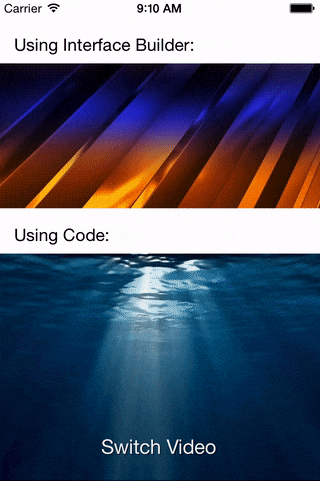

# AKVideoImageView


This class was created because I wasn't satisfied with standard Apple AVPlayer during creating a video background for one of my apps. AVPlayer doesn't let the phone to go to sleep mode. Also, you can't insensibly start a video from the first frame when app enters background. This class solves these problems, and in the end, you have a perfect solution for making gorgeous video backgrounds for your apps.



## Features

- Ability to dynamically switch videos
- Auto set the first frame of video to have seamless transition when app returns from background
- Minimal memory footprint
- Good performance
- Ability to use mp4 files as video source


## Installation

#### Manually
Just add AKVideoImageView.h and AKVideoImageView.m files to your project.

#### CocoaPods
Add the following line to your Podfile.

```
pod "AKVideoImageView", "~> 1.0"
```

Then run `pod install`.

## Usage

### Compressing your video file
Before starting using this class, you need to properly compress video.<br /> Here is an example of libx264 compression options on OS X system using ffmpeg utility:
<br />ffmpeg -i input.mov -vcodec libx264 -level 3.1 -pix_fmt yuv420p -threads 1 -preset placebo -crf 19 -tune film -x264opts colorprim=bt709:transfer=bt709:colormatrix=bt709:fullrange=off output.mp4

### Basic Setup

Objective-C:<br />
```objective-c
#import "AKVideoImageView.h"

NSURL *videoURL = [[NSBundle mainBundle] URLForResource:@"videoName" withExtension:@"mp4"];
AKVideoImageView *videoBG = [[AKVideoImageView alloc] initWithFrame:self.view.bounds
                                                           videoURL:videoURL];
[self.view addSubview:videoBG];
[self.view sendSubviewToBack:videoBG];
```

Swift:<br />
```swift
import AKVideoImageView

let url = Bundle.main.url(forResource: "video_1", withExtension: "mp4")!
let videoView = AKVideoImageView(frame: view.bounds, videoURL: url)!
view.addSubview(videoView)
```

### Dynamically changing video

```objective-c
NSURL *videoURL = [[NSBundle mainBundle] URLForResource:@"anotherVideoName" withExtension:@"mp4"];
self.videoBG.videoURL = videoURL;
```


## License (MIT)

Copyright (c) 2015 Oleksandr Kirichenko

Permission is hereby granted, free of charge, to any person obtaining a copy of this software and associated documentation files (the "Software"), to deal in the Software without restriction, including without limitation the rights to use, copy, modify, merge, publish, distribute, sublicense, and/or sell copies of the Software, and to permit persons to whom the Software is furnished to do so, subject to the following conditions:

The above copyright notice and this permission notice shall be included in all copies or substantial portions of the Software.

THE SOFTWARE IS PROVIDED "AS IS", WITHOUT WARRANTY OF ANY KIND, EXPRESS OR IMPLIED, INCLUDING BUT NOT LIMITED TO THE WARRANTIES OF MERCHANTABILITY, FITNESS FOR A PARTICULAR PURPOSE AND NONINFRINGEMENT. IN NO EVENT SHALL THE AUTHORS OR COPYRIGHT HOLDERS BE LIABLE FOR ANY CLAIM, DAMAGES OR OTHER LIABILITY, WHETHER IN AN ACTION OF CONTRACT, TORT OR OTHERWISE, ARISING FROM, OUT OF OR IN CONNECTION WITH THE SOFTWARE OR THE USE OR OTHER DEALINGS IN THE SOFTWARE.
